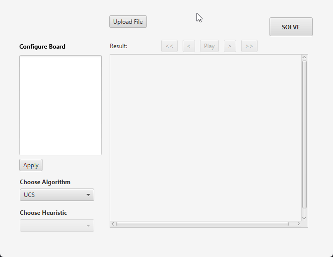

# Penyelesaian Puzzle Rush Hour Menggunakan Algoritma Pathfinding - Tugas Kecil 3 IF2211 Strategi Algoritma


## Deskripsi Singkat


## Persyaratan Sistem
Sebelum menjalankan program, pastikan Anda telah melakukan instalasi Java Development Kit (JDK) untuk menjalankan program berbasis Java ini. Anda dapat mengunduh JDK melalui [pranala](https://www.oracle.com/in/java/technologies/downloads/#java23) ini.

## Instalasi / Memulai
Silakan clone repositori ini dengan menjalankan perintah di bawah pada terminal.
```sh
git clone https://github.com/karolyangqian/Tucil3_13523077_13523093.git
cd Tucil3_13523077_13523093
```

### Menjalankan Program
Jalankan perintah di bawah ini untuk mengompilasi dan menjalankan program.
```sh
javac -d bin src/*.java
java -cp bin Main
```


## Laporan
[Google Docs Laporan]()


## Authors
|     NIM    |                  Nama                  |
| :--------: | :------------------------------------: |
| 13523077   | Albertus Christian Poandy              |
| 13523093   | Karol Yangqian Poetracahya             |